# Job-Search-Auto-Match-Resume-with-AI-Cover-Letter-Telegram-Alerts
Automated job search workflow using n8n. Fetches LinkedIn jobs, compares them with your resume via AI, scores matches, generates tailored cover letters, stores results in Google Sheets, and sends Telegram alerts for high-scoring opportunities.

# 🚀 Automated Job Search & Resume Matching with AI (n8n Workflow)

This repository contains an **n8n workflow** that automates the process of searching jobs on LinkedIn, comparing them with your resume using AI, scoring matches, and notifying you on Telegram.

---

## 📌 Features
- ⏰ Runs automatically every day at 5 PM (customizable).
- 📄 Downloads your resume (PDF from Google Drive).
- 🔎 Reads job search parameters (keywords, location, job type, etc.) from Google Sheets.
- 🌐 Fetches job listings from LinkedIn.
- 🤖 Uses **AI (OpenAI/Gemini)** to:
  - Compare job description with your resume.
  - Score the match (0–100).
  - Generate a sample cover letter tailored to the job.
- 📊 Saves job details & scores in Google Sheets.
- 📲 Sends Telegram alerts for jobs above a chosen score threshold (default: 50).

---

## ⚙️ Workflow Steps

1. **Trigger**
   - Runs daily at 5 PM using the **Schedule Trigger**.

2. **Resume Handling**
   - Downloads your resume (Google Drive).
   - Extracts text from PDF.

3. **Job Search Setup**
   - Reads search parameters from Google Sheets.
   - Creates LinkedIn job search URL.
   - Fetches jobs from LinkedIn.
   - Extracts job links.
   - Splits job links to process individually.

4. **Job Processing**
   - Loops over each job link.
   - Waits 10 seconds (to avoid rate limiting).
   - Fetches the job page.
   - Extracts job attributes (title, company, location, description, apply link).
   - Modifies attributes if needed.

5. **AI Resume Matching**
   - AI compares resume with job description.
   - Provides match score (0 = no match, 100 = perfect match).
   - Generates a sample cover letter.

6. **Storing & Filtering**
   - Saves job details + score into Google Sheets.
   - Filters jobs with score > 50.

7. **Notifications**
   - Sends Telegram message with job details if score > 50.

## 🗂️ Workflow Overview  

```mermaid
flowchart LR
    subgraph R[📄 Resume Handling]
        A[Schedule Trigger] --> B[Download Resume] --> C[Extract Text]
    end

    subgraph J[🔎 Job Search]
        C --> D[Read Params] --> E[Create URL] --> F[Fetch Jobs] --> G[Extract Links] --> H[Split Jobs]
    end

    subgraph P[⚙️ Job Processing]
        H --> I[Loop Jobs] --> J1[Wait 10s] --> K[Fetch Page] --> L[Parse Job] --> M[Modify Attr.]
    end

    subgraph AIm[🤖 AI Matching]
        M --> N[AI Match] --> O[Parse Output]
    end

    subgraph S[📊 Store & Filter]
        O --> P1[Update Sheet] --> Q[Filter > 50]
    end

    subgraph Ntfy[📲 Notifications]
        Q --> R[Telegram Alert]
    end

```

🛠️ Requirements
n8n

Google Drive API (for resume)

Google Sheets API (for search parameters & results)

Gemini API (for AI matching,addressing Missing_skills & write cover letter)

Telegram Bot API (for notifications)
---
📊 Example Output in Google Sheet
Job Title	Company	Location	Score	Apply Link	Cover Letter
Data Scientist	ABC Inc	Remote	87	Apply	Generated CL
AI Engineer	XYZ Ltd	India	62	Apply	Generated CL

---
 How to Use

Import workflow JSON into your n8n instance.

Configure:

Google Drive credentials (resume storage).

Google Sheets (job parameters & results).

OpenAI/Gemini API key.

Telegram Bot credentials.

Set your desired job score threshold.

Execute the workflow manually or let it run on schedule.
---
📌 Notes
Default score filter is > 50. You can modify it in the workflow.

Add multiple job search parameters in the Google Sheet for broader coverage.

Works best when your resume has clear skills & experience keywords.
---
📷 Workflow Screenshot

